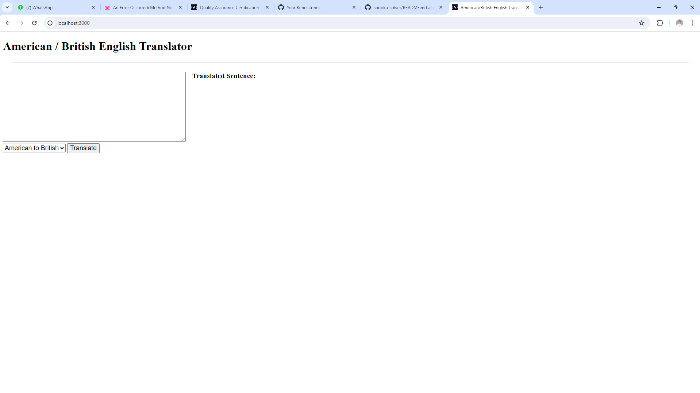

# American British Translator

This is a simple project that I did to get the [Quality Assurance course](https://www.freecodecamp.org/learn/quality-assurance) by FreeCodeCamp. The boilerplate can be found at [this link](https://www.freecodecamp.org/learn/quality-assurance/quality-assurance-projects/american-british-translator).

## Explanation about the project

These are the requirements that I have fulfilled to complete this project:

- All logic can go into /components/translator.js
- Complete the /api/translate route in /routes/api.js
- Create all of the unit/functional tests in tests/1_unit-tests.js and tests/2_functional-tests.js
- See the JavaScript files in /components for the different spelling and terms your application should translate
- To run the tests automatically, set NODE_ENV to test without quotes in the .env file
- To run the tests in the console, use the command npm run test.

I have also written some tests in **tests/1_unit-tests.js**. These are the criteria:

- Translate Mangoes are my favorite fruit. to British English
- Translate I ate yogurt for breakfast. to British English
- Translate We had a party at my friend's condo. to British English
- Translate Can you toss this in the trashcan for me? to British English
- Translate The parking lot was full. to British English
- Translate Like a high tech Rube Goldberg machine. to British English
- Translate To play hooky means to skip class or work. to British English
- Translate No Mr. Bond, I expect you to die. to British English
- Translate Dr. Grosh will see you now. to British English
- Translate Lunch is at 12:15 today. to British English
- Translate We watched the footie match for a while. to American English
- Translate Paracetamol takes up to an hour to work. to American English
- Translate First, caramelise the onions. to American English
- Translate I spent the bank holiday at the funfair. to American English
- Translate I had a bicky then went to the chippy. to American English
- Translate I've just got bits and bobs in my bum bag. to American English
- Translate The car boot sale at Boxted Airfield was called off. to American English
- Translate Have you met Mrs Kalyani? to American English
- Translate Prof Joyner of King's College, London. to American English
- Translate Tea time is usually around 4 or 4.30. to American English
- Highlight translation in Mangoes are my favorite fruit.
- Highlight translation in I ate yogurt for breakfast.
- Highlight translation in We watched the footie match for a while.
- Highlight translation in Paracetamol takes up to an hour to work.

I have also written some tests in **tests/2_functional-tests.js**. These are the criteria:

- Translation with text and locale fields: POST request to /api/translate
- Translation with text and invalid locale field: POST request to /api/translate
- Translation with missing text field: POST request to /api/translate
- Translation with missing locale field: POST request to /api/translate
- Translation with empty text: POST request to /api/translate
- Translation with text that needs no translation: POST request to /api/translate

The original page explaining the requirements could be found at [this](https://www.freecodecamp.org/learn/quality-assurance/quality-assurance-projects/american-british-translator) link.

## To run project

### Requirements

To run the project you need to have:

- Internet Connection
- Visual studio code installed
- Node installed

### Steps to run the project

- Git clone this project
- go to root project
- Write: npm install
- Write: npm run start

### To run tests

- Check your sample.env
- change the name into '.env
- remove the comment for 'test'
- run: npm run test

### To run the project automatically:

- add NODE_ENV=test in your .env file
